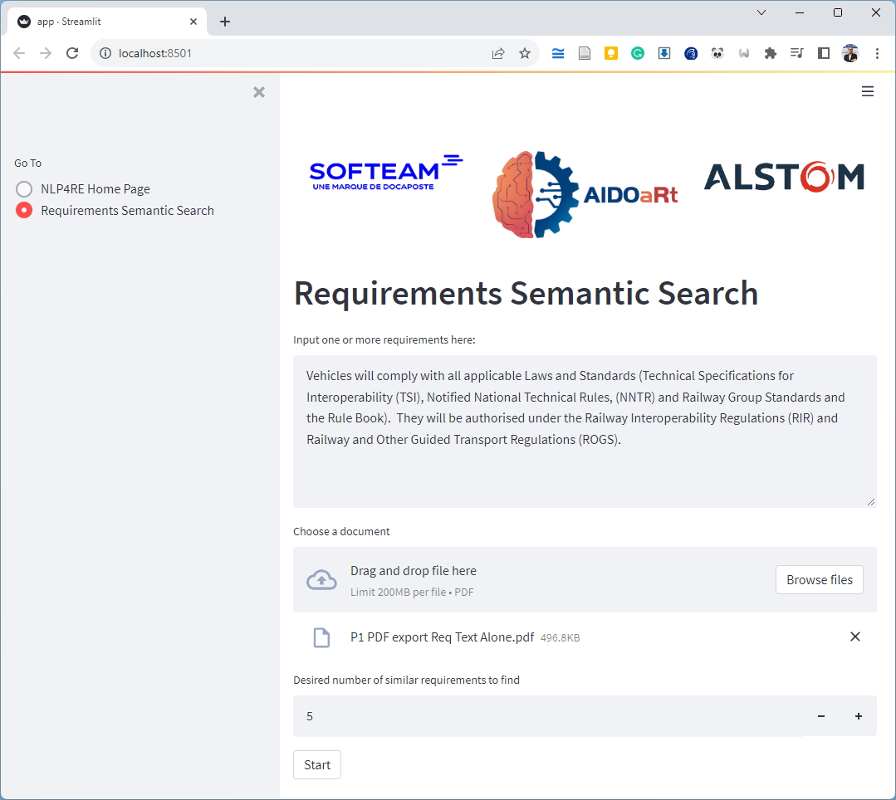
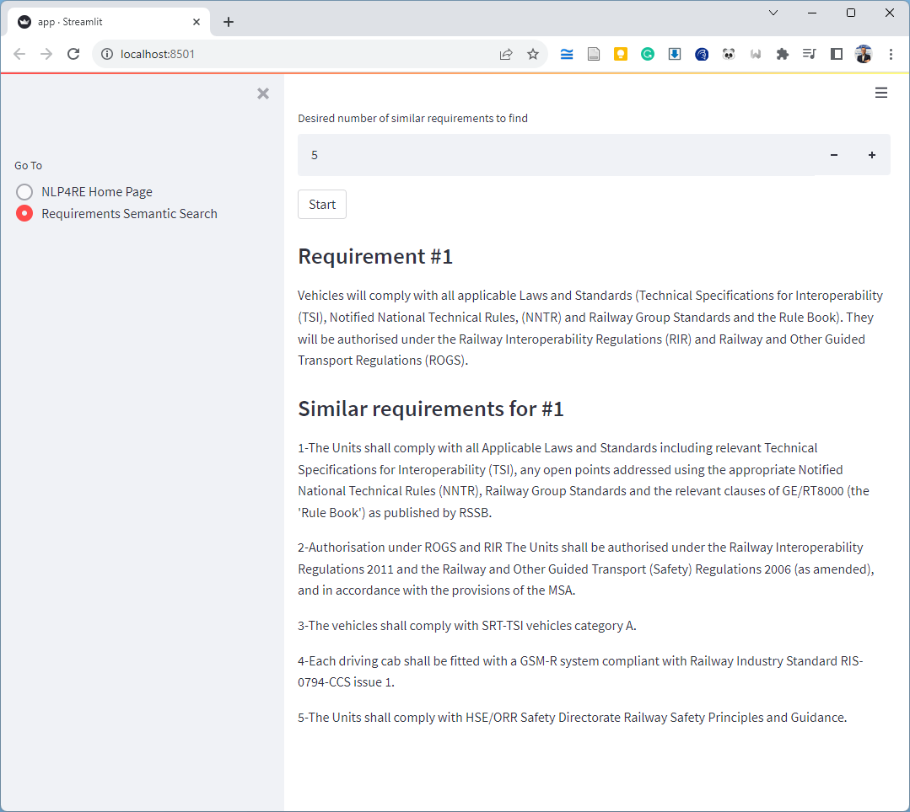

# NLP4RE
This application uses Natural Language Processing (NLP) techniques for Requirements Engineering (RE), or NLP4RE for short. Currently, it offers a prototype called "Requirements Semantic Search" that evaluates the semantic similarity of requirement text and thus can be used for semantic search of a given requirement in a large requirements document.
    
The NLP4RE Prototype is designed for use in RE case studies where businesses and industries are studying recurrent clients' bids or tenders with relatively similar or standard requirements specification documents and who are interested in providing their RE teams with insights on new projects based on responses to previous ones.  For instance, it helps RE teams while studying new bid and tender documents by identifying similar requirements from previous projects, and thus to tackle and answer the new requirements based on answers to the previous similar ones (e.g., allocate similar requirements to similar teams, respond to requirements compliance similarly, etc.).

## Demo
When the application is run, you can drag-and-drop a PDF file with a set of requirements text, type a given requirement, and hit the "Start" button to find the (k) most similar requirements from the PDF.



## Roadmap
This prototype application is still a work in progress and shall be updated with more features in the future.        
    
**Updates (Dec 2023):**
- Release as a runnable web application
- Containerization with Docker
    
**Next:**
- Separate the web back-end (Flask or FastAPI) and front-end (streamlit)


## Prerequisites
```
Python 3.8-3.9
```

## How to Run

1. Clone the repository:
```
$ git clone https://github.com/Modelio-R-D/NLP4RE.git
$ cd NLP4RE
```

2. Install dependencies:
```
$ pip install -r requirements.txt
```

3. Start the application:
```
streamlit run app.py
```

OR 

If you want to specify port number (e.g. port #8502):
```
streamlit run app.py --server.port 8502
```

## Notes
The first launch might take some time to download all necessary NLP models and libraries.

## Credits        
This application was developed by Bilal Said from the Softeam R&D team within the framework of the AIDOaRt project and applied to datasets provided by Alstom (BT) on railway systems tender documents and HI iberia Ingenieria Y Proyectos SL (HIB) on Trello cards in Spanish. The NLP4RE Prototype is planned for integration in Modelio in case of validation for commercial use by the Modelio Core Development Team.
    
The code base has been inspired by prototypes developed for the VeriDevOps project by Kirill Yakovlev, Andrey Sadovykh, and Alexander Naumchev.

This work is supported by the European Commission through the link:
[AIDOaRt Horizon Europe project](https://www.aidoart.eu/).

